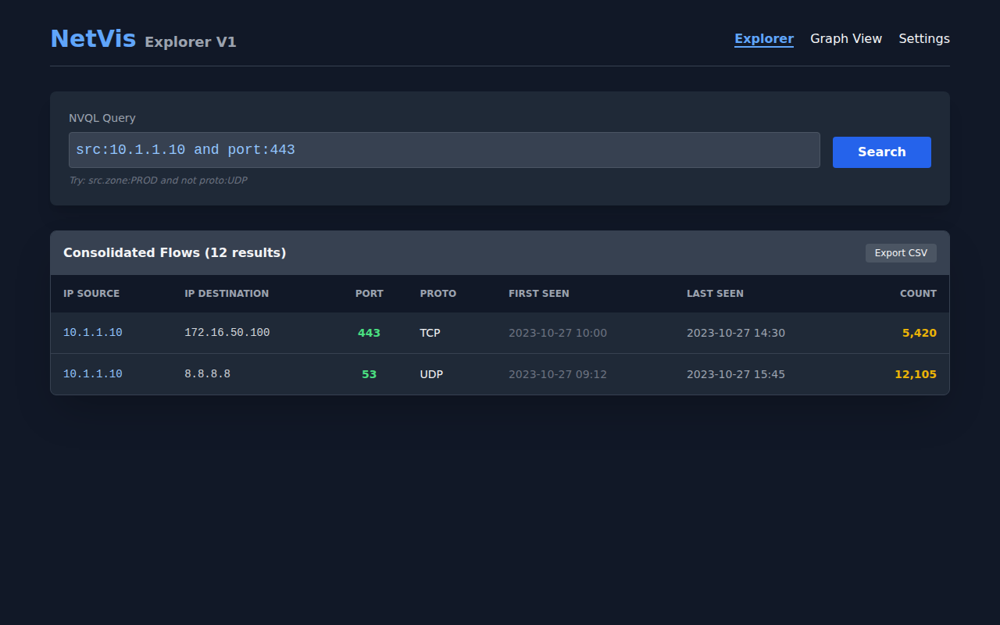
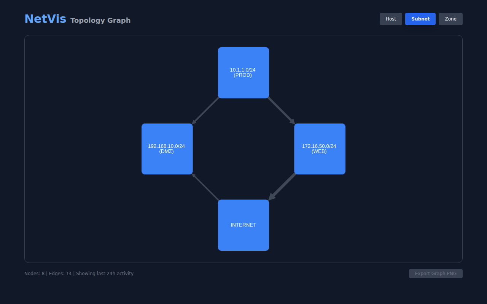
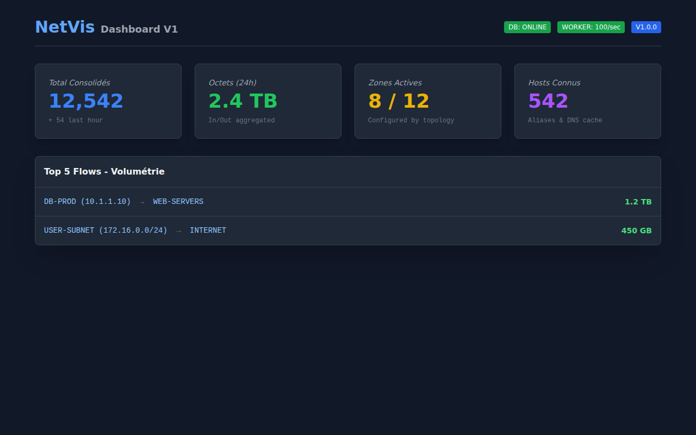

# NetVis V1 - Observatoire de Flux Réseau On-Prem

NetVis est un outil d'observabilité réseau conçu pour offrir une vision consolidée des flux réels observés (Nexus, F5) au sein d'un SI.

## 🖥️ Aperçu de l'Interface

### 1. Explorateur de Flux (Recherche NVQL)
Recherche puissante et intuitive utilisant le langage **NVQL**.


### 2. Cartographie Topologique
Visualisation graphique des dépendances entre hôtes, subnets ou zones.


### 3. Tableau de Bord (Reporting)
Vue d'ensemble des métriques de trafic et des "Top Talkers".


## 🚀 Démarrage Rapide

### Prérequis
- Docker & Docker Compose
- Python 3.11+ (pour les tests locaux)

### Lancer l'infrastructure (PostgreSQL, Redis, API, Worker, Collector)
```bash
docker-compose up --build
```
L'API sera disponible sur `http://localhost:8000/health`.

### 💾 Gestion de la Base de Données

Pour **réinitialiser complètement** votre base de données :
```bash
cd backend
./scripts/reset_db.sh
```

## 🧪 Tests & Simulation de données

### 1. Tests Unitaires & Intégration
```bash
cd backend
PYTHONPATH=. pytest tests/
```

### 2. Simulation de trafic (Nexus/F5)
```bash
cd backend
python scripts/generate_test_data.py
```

## ⚙️ Configuration des équipements (Ingestion)

### Cisco Nexus 9000 (NetFlow/IPFIX)
Configurez l'exportation des flux vers l'IP de votre serveur NetVis (UDP/9995) :
```text
feature netflow

flow exporter NETVIS_EXPORTER
  destination <IP_SERVEUR_NETVIS>
  transport udp 9995
  source <INTERFACE_SOURCE>
  version 9

flow record NETVIS_RECORD
  match ipv4 source address
  match ipv4 destination address
  match transport destination-port
  match ipv4 protocol
  collect counter bytes
  collect counter packets
  collect timestamp sys-uptime first
  collect timestamp sys-uptime last

flow monitor NETVIS_MONITOR
  record NETVIS_RECORD
  exporter NETVIS_EXPORTER

interface <VLAN_OU_INTERFACE_A_SURVEILLER>
  ip flow monitor NETVIS_MONITOR input
```

### F5 AFM/LTM (HSL / IPFIX)
1. **Pool :** Créez un pool `pool_netvis` contenant l'IP du serveur NetVis sur le port UDP 9995.
2. **Log Destination :** Créez une destination `dest_netvis` de type `IPFIX` pointant vers ce pool.
3. **Log Publisher :** Créez un publisher `pub_netvis` incluant cette destination.
4. **AFM Policy :** Dans votre Network Firewall Policy, activez le logging et sélectionnez `pub_netvis`.

## 📂 Structure du Projet
- `PROPOSAL.md` : Architecture détaillée (18 points).
- `architecture.mermaid` : Diagramme logique.
- `init_db.sql` : Schéma PostgreSQL.
- `docs/screenshots/` : Illustrations de l'UI.

## 🔍 NetVis Query Language (NVQL)
- `src:10.1.1.1 and port:443`
- `dst.zone:DMZ and not proto:UDP`
- `tag:PROD`
